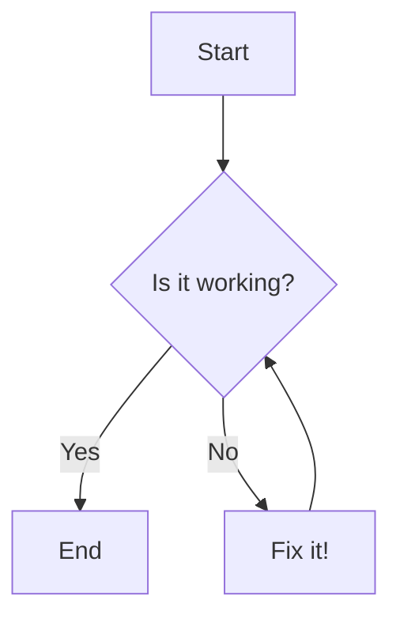

# Development & Learning Notes

This file is for logging our decisions and for providing explanations and learning opportunities. As we work together, feel free to ask any questions you have. Think of me as your personal tutor; there are no stupid questions!

---

## Log Entry Template

### Date: [YYYY-MM-DD]

**Topic:** (What is this note about?)

**Our Decision / The Code:**

(Explain the decision that was made or the code that was written.)

**Reasoning:**

(Explain why the decision was made or why that specific code was used.)

**Alternatives We Considered:**

(What other solutions were considered and why were they not chosen?)

**Glossary Terms:** (Any new terms or concepts introduced that should be added to GLOSSARY.md?)

### 🤓 Learning Corner

**(Optional) Ask any questions you have about this topic. For example:**
*   "Can you explain this function in more detail?"
*   "Why did you choose to use `X` instead of `Y`?"
*   "What is 'asynchronous programming' and how does it apply here?"

**(My explanation will go here.)**

---

---

## Formal Decisions (ADRs)

While this file is used for day-to-day notes and learning, all significant architectural decisions are formally documented as **Architecture Decision Records (ADRs)** in the `/decisions` folder.

When we make a key decision, we will create a new ADR file in that directory. We can then reference it here in our daily notes, for example:

> **Topic:** User Authentication Strategy
> **Our Decision:** We have decided to use JWTs for authentication. See the full context and consequences in [ADR-001](link-to-adr-file).

---

## Visual Documentation with Mermaid.js

For explaining complex architectures, data flows, or logic, we can use Mermaid.js to create diagrams directly within our Markdown files. This is a safe practice, as the Mermaid code is just a block of text and will not break the file. Most modern Markdown viewers, including GitHub's, will render this code as a diagram.

**Example of a flowchart:**

We can use this for sequence diagrams, entity relationship diagrams, and more to visually communicate our ideas.
